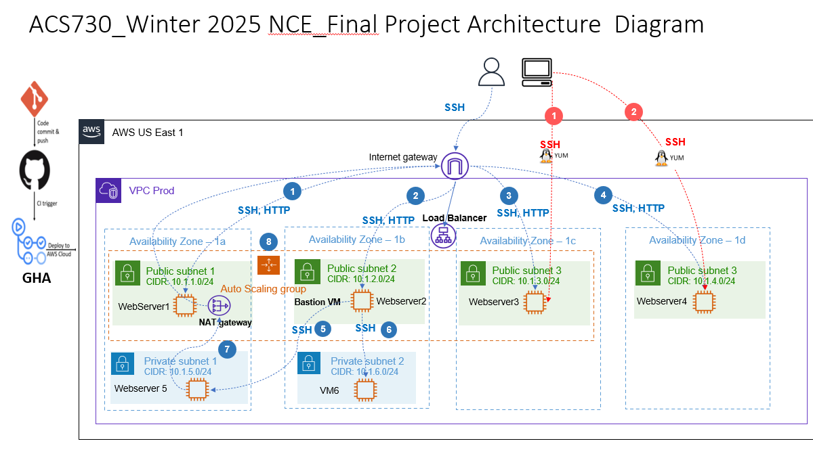

# Objective
Build the following architecture:


# Prerequisites
## Step 1: Create S3 Buckets
Set up S3 buckets to store the Terraform state files and the image used by the web servers.

The Terraform state is stored in a bucket called `acs730-final-nh` in this project. You can use any globally unique name and update the value in the `backend.tf` files located under `staging/aws_network` and `prod/aws_network`. The buckets are already set in a way that the remote file of different environments is saved under different folders.

Another bucket named `ansibleprojectassets` has been created for this project. The `ansible_terraform.jpeg` image located under the `assets` folder has been uploaded to that bucket. This image will be displayed on the web servers deployed by Ansible. You can upload your own image to your own bucket and ensure you have access to it.

# Deployment Instructions 

## Manual Deployment Instructions

### Deploy the Network Infrastructure
1. Navigate to the `<environmentName>/aws_network` directory.
2. Initialize Terraform with the command: `terraform init`.
3. Deploy the network infrastructure by running: `terraform apply`.

### Generate a Key Pair for Web Servers and Deploy Webservers
1. Navigate to the `<environmentName>/aws_webservers` directory.
2. Create a key pair named `nh` in the `aws_webservers` folder using the command: `ssh-keygen -t rsa -f nh`.
3. Initialize Terraform with the command: `terraform init`.
4. Deploy the web server infrastructure by running: `terraform apply`.

### Install Ansible and required libraries
1. Install ansible using the  command: `sudo yum install -y ansible`
2. Install Python and Required Libraries (boto3, botocore)<br>
First, make sure pip3 is installed: `sudo yum install -y python3-pip`<br>
Then, install the required Python libraries:
`pip3 install boto3 botocore`

### Install Amazon AWS Collection for Ansible
Install the Amazon AWS Ansible collection using:`ansible-galaxy collection install amazon.aws`

### Run the Playbook
Once everything is installed, navigate in the `ansible` directory and run the playbook to set up the web server:
`ansible-playbook playbooks/webserver_setup.yml`

## Automatic Deployment with GitHub Actions

The GitHub Actions workflow will automatically deploy your infrastructure whenever changes are pushed/merged to the `prod` branch.

### Configure AWS Credentials in GitHub
1. Go to the repository's Settings > Secrets > Actions. <br>
2. Add the following secrets:<br>
```export AWS_ACCESS_KEY_ID="your-access-key-id"
export AWS_SECRET_ACCESS_KEY="your-secret-access-key"
export AWS_SESSION_TOKEN="your-session-token" 
```
 <br>
These credentials will allow GitHub Actions to interact with AWS during the deployment process.

### Push Changes to Trigger Deployment <br>
1. Create Pull Request from Staging to prod branch. After merging changes to the `prod` from `staging` branch, the GitHub Actions workflow will automatically:<br>
**Initialize Terraform**: Run terraform init in both aws_network and aws_webservers directories. <br>
**Plan Changes**: Run terraform plan to preview the changes.<br>
**Apply Changes**: Run terraform apply to deploy the infrastructure to AWS.<br>

Changes to the `staging/aws_network` and `staging/aws_webservers` directories will trigger this workflow.

## Branch Protection
Direct pushes to prod are prohibited to ensure all changes are thoroughly reviewed and tested through GitHub Actions workflows before deployment.

### Monitor Deployment
You can monitor the progress of the GitHub Actions workflow directly in the Actions tab of the GitHub repository. 

# Clean Up Instructions
## Destroy the Infrastructure
1. Navigate to the `<environmentName>/aws_webservers` directory.
2. Destroy the infrastructure with command: `terraform destroy -auto-approve`.
3. Navigate to the `<environmentName>/aws_network` directory.
4. Destroy the infrastructure with command: `terraform destroy -auto-approve`.

## Clean Your Workspace
1. Delete the S3 bucket used to store the Terraform remote state files.
2. Delete the S3 bucket containing the image displayed on the web servers if relevant.